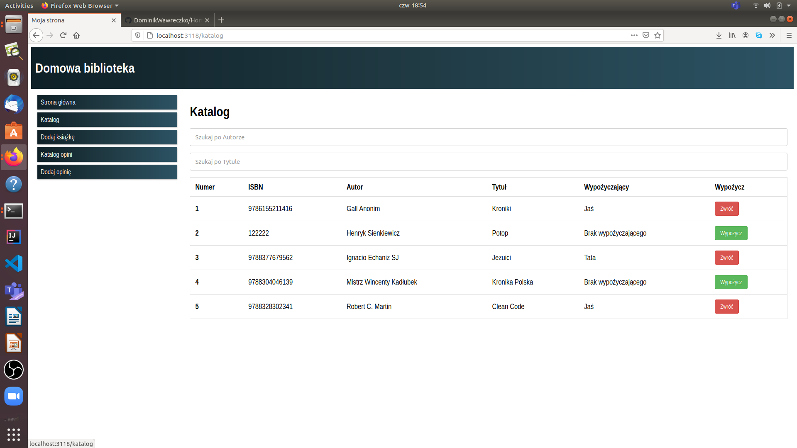
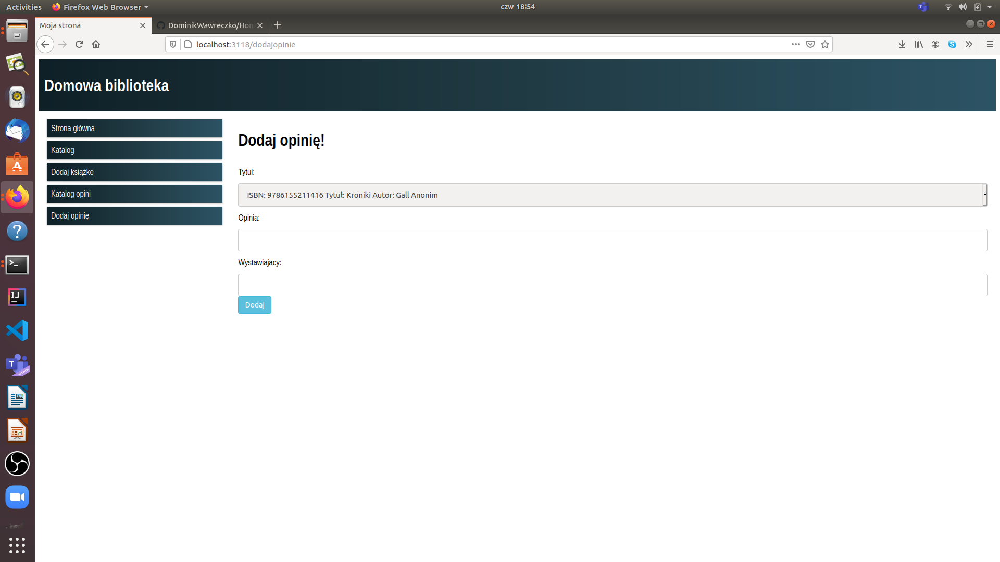

# Home Library
> This is a node.js application powered by  Express, which can help manage every home library.

## Table of contents
* [General info](#general-info)
* [Screenshots](#screenshots)
* [Technologies](#technologies)
* [Setup](#setup)
* [Status](#status)

## General info
This application can help manage every home library, remind us who borrowed our books or even help us write a review. 

## Screenshots

## Technologies
* npm - version 6.14.10
* express-generator - version 4.16.1
* node.js - version 14.15.4
* nodejs-mysq version l2.18.1

## Setup

Clone this repo to your desktop, import database from "./DataBaseToIMPORT/WWW20_WAWRECZKO.sql" to your local sql server config user data in "./config/db.js" and run `npm install` to install all the dependencies.

## Status
Project is: _finished_ - project was created only for academic purposes

